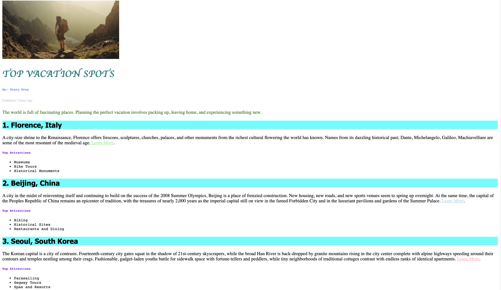

# Vacation World

## Description

This project is a travel-themed website that showcases top vacation spots around the world. It provides information about various destinations, including Florence, Italy; Beijing, China; and Seoul, South Korea, among others.

## Features

- Detailed descriptions of various vacation spots
- Links to learn more about each destination
- List of top attractions for each destination

## Files

- `index.html`: This is the main HTML file that contains the structure of the website.
- `style.css`: This file contains the styles for the website.

## How to View

You can view the website by opening the `index.html` file in any web browser.

## Contributing

Contributions are welcome. Please open an issue first to discuss what you would like to change.

## License

Information about the license.

